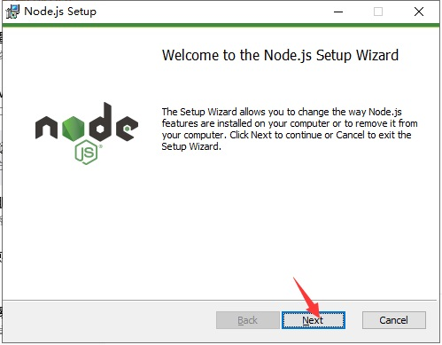
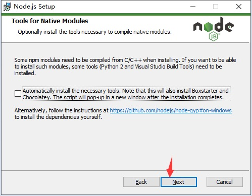
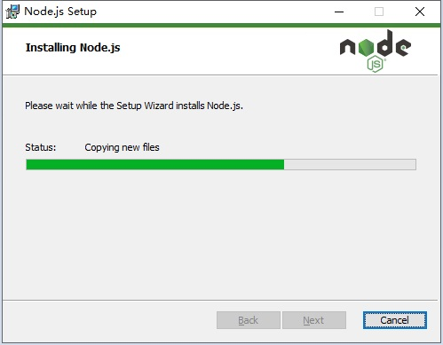

# 前端基础

## 软件安装和配置

- 检查软件安装版本
  - 执行`node -v`检查 node.js 是否安装成功,当前项目使用 v10 版本
  - 执行`cnpm -v`检查 cnpm 是否安装成功 (需要在 node 安装成功)
  - 执行`gulp -v`检查 gulp 是否安装成功 (需要在 node 安装成功)
- 安装软件

  - [nodejs 官方网站](http://nodejs.org)
    - [nodejs v10 下载地址](https://nodejs.org/dist/v10.13.0/node-v10.13.0-x64.msi)
    - 安装图示
    -   
         
         
         
         
         
         
       
  - [nodejs 淘宝源](http://npm.taobao.org/)
    - 执行`npm config set registry http://registry.npm.taobao.org`设置淘宝源
    - 执行`npm -g install cnpm`安装 cnpm
  - [gulp 官方网站](https://gulpjs.com)
    - 执行`cnpm -g install gulp`全局安装 gulp 客户端

## 项目配置和初始化

- 执行`cnpm init`初始化项目 npm
  - 1:package name(目录名称):输入项目名称,回车默认就是目录名称
  - 2:version(1.0.0):输入项目版本号
  - 3:description:输入项目描述
  - 4:entry point:(index.js):入口 js
  - 5:test command:测试命令
  - 6:git repository:git 地址
  - 7:keywords:关键字
  - 8:author:作者
  - 9:license: (ISC):版权协议
  - 10:Is this OK? (yes):确认完成
  - 执行完成项目里会出现 package.json,可以直接修改该文件
- 安装 jquery 和 bootstrap3
  - 执行`cnpm --save install jquery`安装 jquery
  - 安装成功,`package.json`中`dependencies`小节中会出现 jquery 版本号,项目`node_modules`目录中也会出现 jquery
  - 执行`cnpm --save install bootstrap3`安装 bootstrap3
  - 安装成功,`package.json`中`dependencies`小节中会出现 bootstrap 版本号,项目`node_modules`目录中也会出现 bootstrap3
- 配置 js 提示

  - 在项目根目录创建[jsconfig.json](jsconfig.json)文件
  - `exclude`小节是配置忽略的文件或者目录的列表,一定要将`node_modules`目录排除,该目录是 nodejs 插件目录,也不要将该目录添加到 git 中
  - `typeAcquisition`小节是配置要 js 提示的 api 列表

- vscode 插件安装

  - Chinese (Simplified) Language Pack for Visual Studio Code (简体中文语言包)
  - Bracket Pair Colorizer (括号着色配对插件)
  - HTML CSS Support (html 文件中 css 类名称支持插件)
  - Markdown All in One (markdown (md) 文件编辑预览插件)
  - markdownlint (markdown 文件语法检查)
  - nginx.conf (nginx 配置文件插件)
  - nginx-formatter (nginx 格式化插件)
  - open in browser (在浏览器中打开插件)
  - Prettier - Code fotmatter (代码格式化插件)
  - VSCode Great Icons (一套 vscode 图标库,在文件图标主题中使用)

- 安装前端相关开发工具 nodejs 插件
  - 执行`cnpm --save install gulp`安装 gulp 依赖
  - 执行`cnpm --save install del`安装 del(文件删除插件)依赖
  - 执行`cnpm --save install gulp-file-sync`安装 gulp-file-sync(文件同步插件) 依赖
  - 执行`cnpm --save install gulp-watch`安装 gulp-watch(文件变化检测插件) 依赖
  - 执行`cnpm --save install gulp-concat`安装 gulp-concat(文件合并检测插件) 依赖
  - 执行`cnpm --save install jshint gulp-jshint`安装 gulp-jshint(js 语法插件) 依赖
  - 执行`cnpm --save install gulp-uglify`安装 gulp-uglify(js 混淆插件) 依赖
  - 执行`cnpm --save install gulp-plumber`安装 gulp-plumber(gulp 错误冒泡插件) 依赖
  - 执行`cnpm --save install gulp-clean-css`安装 gulp-clean-css(css 压缩插件) 依赖
  - 执行`cnpm --save install gulp-sourcemaps`安装 gulp-sourcemaps(map 文件插件) 依赖
- 项目开发脚本
  - 执行`StartDev.bat`启动开发者模式(开启 nginx,打开浏览器,开启项目 dev)
  - `gulp dev`的窗口通过案件`ctrl+c`后输入`y`中断执行
  - `browser.js`的窗口可以直接关闭
  - `StartNginx`的窗口需要执行`StopNginx.bat`中断执行后关闭
  - 如果`gulp dev`意外中断只需要单独执行`StartWatch.bat`重新开启
  - 如果`StartNginx`意外中断只需要执行`StopNginx.bat`确认中断后在执行`StartNginx.bat`重新开启
  - 如果浏览器关闭需要执行`StartBrowser.bat`重新开启
- 项目 clone 后的初始化步骤
  - 确保 [软件安装和配置](#软件安装和配置)的步骤已经执行
  - 修改`browser.js`中的浏览器位置为正确的本机位置
  - 修改`StartNginx.bat`和`StopNginx.bat`中的 nginx 的位置为正确的本机位置
  - 执行`cnpm install`初始化插件和依赖
  - 执行`gulp build`指令初始化项目后即可进入`项目开发脚本`的步骤启动开发模式